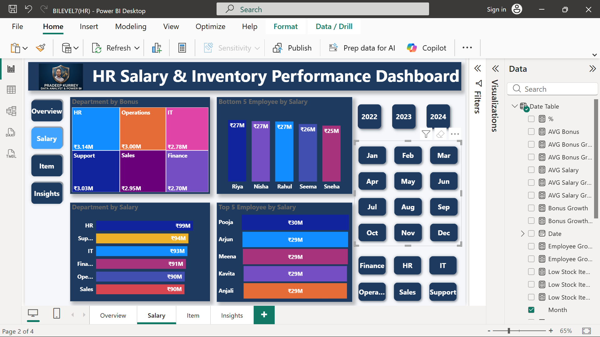
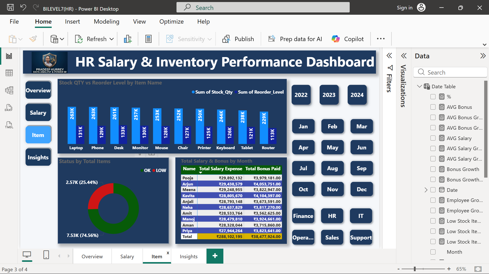
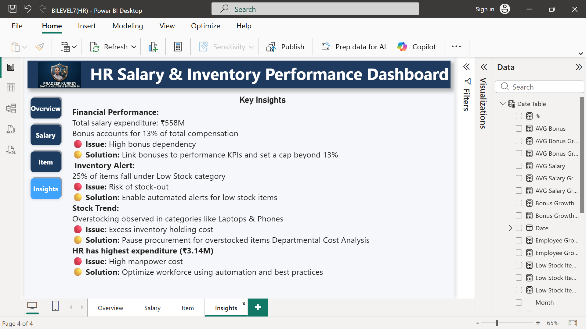

# HR-Salary-Inventory-Dashboard
Power BI dashboard for salary and inventory analysis
# 📊 HR Salary & Inventory Performance Dashboard

## 🚀 Overview

This project is an interactive Power BI dashboard that analyzes employee salary data along with inventory performance to provide meaningful business insights.
The goal is to transform raw data into actionable insights for better decision-making.

---

## 📌 Key Features

- Total Employees Analysis
- Salary & Bonus Distribution
- Inventory Stock Monitoring
- Low Stock Alerts
- Department-wise Cost Analysis
- Interactive Filters (Year, Month, Department)

---

## 📊 Key Insights

- Total salary expenditure reached ₹558M with bonuses contributing 13%
- 25% of inventory falls under the low stock category
- Overstocking observed in categories like laptops and phones
- HR department has the highest operational cost

---

## 🛠️ Tools & Technologies

- Power BI
- DAX (Data Analysis Expressions)
- Power Query (Data Cleaning & Transformation)
- Data Modeling

## 🔄 Data Processing Steps

 ## 1. Cleaned raw data (removed nulls, duplicates, formatted columns)
   
  
  
 ## 2. Transformed data using Power Query
 

 
 ## 3. Created relationships between tables (data modeling)
 
 

 
## 📐 DAX Measures

[View DAX Formulas](./DAX.md)

     

## 📊 Dashboard Preview

## 📁 Project Files
[Download Power BI File](./BILEVEL7(HR).pbix)

## 📂 Dataset

[Download Dataset](./hr_inventory_messy_10000.xlsx)

## 💡 Business Value

This dashboard helps organizations:

- Monitor salary expenses effectively
- Optimize bonus distribution
- Manage inventory efficiently
- Take data-driven decisions

## 🔗 Connect With Me

LinkedIn: https://www.linkedin.com/in/pradeep-kurrey-data-analyst/

⭐ If you like this project, don’t forget to star the repo!
